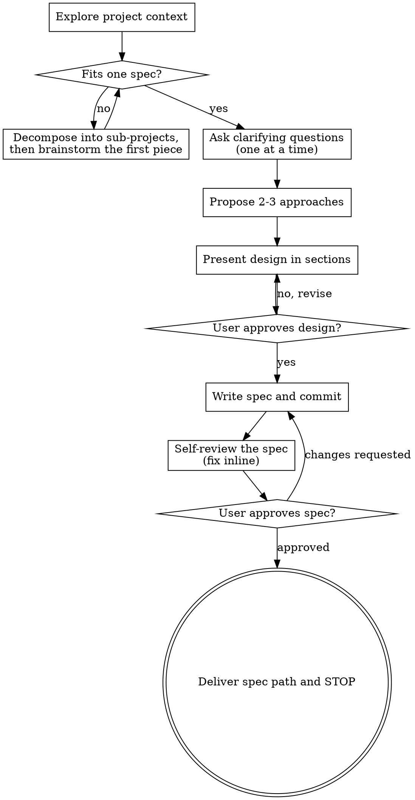

# Turn Ideas Into Design Specs

Brainstorming, with a deliverable: turn an idea into a written, user-approved design spec through conversation. The spec is the whole point — the turn ends when it is written, committed, and the user has the path. Nothing else is produced: no code, no scaffolding, no implementation plan.

## The gate

The design **gates** the code. Nothing gets built, scaffolded, or planned until the user approves a design — for every idea, including the ones that look too small to need one. A small idea gets a short design; the approval step is never skipped. "Simple" projects are exactly where unexamined assumptions cause the most wasted work.

## How the conversation flows

This is a dialogue, not a checklist. The map below shows the natural route, but treat it as a map: loop back whenever a new answer reshapes the idea — ask a question you skipped, re-present a section that stopped making sense, revisit an approach the user has second thoughts about.

### Get your bearings

Look at what exists before proposing anything: files, docs, recent commits, and the conventions that bear on the idea. You should be able to state what the project looks like today and which constraints the design has to fit.

### Fit the idea to one spec

If the request is really several independent subsystems — a "platform" with chat, storage, billing — decompose before questioning: what are the pieces, how do they relate, what order should they be built? Then run this flow on the first piece. Oversized ideas don't get refined; they get split.

### Ask, one question at a time

Purpose, constraints, success criteria. Prefer multiple-choice questions; one question per message — if a topic needs more exploration, break it into several questions. You have enough when you can state the idea back in one sentence and the user agrees it's right.

### Propose 2-3 approaches

Each with its trade-offs, leading with your recommendation and why. Options show the user the space; your recommendation gives them something concrete to react to.

### Present the design in sections

Scale each section to its complexity: a few sentences for a straightforward part, up to a few hundred words for a nuanced one. Check the user agrees after each section before moving on. Cover architecture, components, data flow, error handling, testing.

- Design for isolation: each unit has one purpose, a clear interface, and can be tested on its own; keep units small enough to hold in context.
- Keep the design to what the purpose needs — cut unrequested features.
- In an existing codebase, follow its patterns; fix nearby problems only where they block the goal.

### Write it down

Save the approved design to `docs/spark/YYYY-MM-DD-<topic>-design.md` and commit it. (A user preference for a different location overrides the default.)

### Check it with fresh eyes

Scan the written spec for placeholders (TBD, TODO), contradictions between sections, scope too large for one plan, and requirements that read two ways. Fix any issue inline — no re-review needed, just fix and move on.

### Hand it to the user

Ask them to review the committed file:

> "Spec written and committed to `<path>`. Please review it and let me know if you want any changes before we go further."

Wait for the answer. If changes come back, make them and re-run write → check → hand until approved.

### Stop

Report the spec path and end the turn. No other skill, no implementation planning, no code. The user decides what happens next.

## Key principles

- **One question at a time** — don't overwhelm
- **Multiple choice preferred** — easier to answer than open-ended
- **YAGNI ruthlessly** — remove unrequested features from every design
- **Explore alternatives** — always 2-3 approaches before settling
- **Incremental validation** — present, get approval, move on
- **Be flexible** — loop back when something stops making sense
